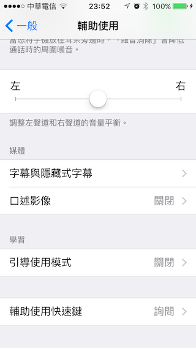
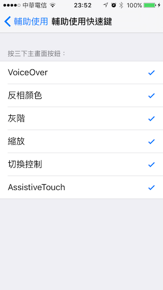

如何使用 VoiceOver
-----------------

由於一般人往往不會開啟 VoiceOver，我們先花點時間，解釋這個功能如何使
用。

### 開啟 VoiceOver

要開啟 VoiceOver，我們要先進入到系統設定中，選擇「一般」（General）設
定，然後進入「輔助使用」（Accesibility）。進入到這一層設定之後，我們馬
上便可以看到第一個選項就是 VoiceOver，我們可以在這邊選擇要開啟或關閉。

不過，每次都要進入設定切換 VoiceOver 相當麻煩，我們通常也會在「輔助使
用」的設定中，設定最後一項設定「輔助使用快速鍵」（Accessibility
Shortcut），然後把 VoiceOVer 加入到 Shortcut 中。

設定了「輔助使用快速鍵」之後，我們就可以透過快速連按 Home 鍵三下，啟用
我們剛才設定的功能。如果我們在「輔助使用快速鍵」設定中，只設定了
VoiceOver，那麼，就會直接開關 VoiceOver，如果是設定了額外的選項，像是
縮放、反白顏色等，就會顯示一個額外的選單，顯示各種可以設定的「輔助使用」
功能。

### VoiceOver 的手勢

啟動了 VoiceOver 之後：

- 對畫面中任何一個 UI 元件單點，就會讓這個元件變成 focus 起來，
  VoiceOver 同時會朗讀這個 UI 元件的標題（這段文字叫做 accessibility
  label）。一些元件會有額外的說明，像是會念出這個元件怎麼使用，如「點
  選兩下以打開」，或，如果是一個 Slider，會告訴你目前 Slider 元件中的
  數值是多少（例如播放進度條會告訴你播到第幾分第幾秒），這些額外說明叫
  做 accessibility hint 與 accessibility value。
- 用單指點選兩下，就可以打開這個 UI 元件。
- 使用單指左右滑動（Swipe），可以移動到畫面中的前一個、或下一個 UI 元
  件。
- 如果某個元件可以調整裡頭的數值，像是 Slider，那麼就可以用往上或往下
  的 Swipe 手勢，切換裡頭的數值。往上是增加、往下是減少，以歌曲播放進
  度來看，往上就是往後快轉，往下就是往前快轉。
- 如果某個元件有多種動作—像是一個歌單 table view 裡頭的 cell，那麼，
  基本上就有播放歌曲與刪除這首歌曲這兩種動作—我們可以用上下的 Swipe 手
  勢，選擇要使用哪種動作，選擇之後就會改變單指點兩下的行為。比方說，歌
  單中的歌曲 cell 原本點兩下是播放歌曲，但我們往下 Swipe 一次換成了刪
  除之後，單指點兩下就變成了刪除。
- 有時候我們會希望可以直接念出畫面中所有的 UI 元件。如果我們用雙指往下
  滑動，就會從目前 focus 的 UI 元件開始，念出下面的所有 UI 元件；如果
  是用雙指往上 Swipe，就會是從畫面的開頭開始，一直朗讀畫面中所有的元件。
- 如果遇到了像 Home Screen 的 App 列表的畫面，用上了 page control 換頁，
  平常我們用單指橫劃換頁，但 VoiceOver 下單指 Swipe 手勢已經被用掉了，
  於是我們要使用三指 Swipe 換頁。
- 如果用三指在畫面中點兩下，就可以讓 iOS 裝置的整個畫面變暗—因為對盲人
  朋友來說，如果完全只用 VoiceOver 操作，那麼就算畫面中什麼都不顯示，
  也不會影響操作，不顯示畫面反而有節電的作用。當我們在開發 VoiceOver
  應用的時候，也可以使用這個模式，試試看即使什麼都看不到，我們是否有辦
  法使用我們的 App。再用三指點兩下就可以回復。

關於 iOS 上的 accessibility 功能如何使用，也可以參考蘋果官網上的說明：
[iOS Accessibility](http://www.apple.com/accessibility/ios/voiceover/)
