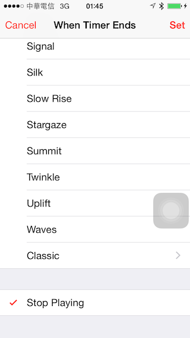

Audio Session
-------------

Audio Session 是一個只在 iOS 上，Mac OS X 沒有的 API，用途是用來描述目
前的 App 打算如何使用 audio，以及我們的 App 與其他 App 之間在 audio 這
部份應該是怎樣的關係。在 iPhoneOS SDK 問世的時候，只有 C API，到了
iPhoneOS 3.0 之後開始有 Objective-C API，放在 AVFoundation framework
中。

### 決定 Audio Session 的 Category

要讓我們的 App 在 audio 的表現上正常，我們必須要先選擇正確的 Audio
Session category，然後將 Audio Session 設定成 active。

``` objc
NSError *audioSessionError = nil;
[[AVAudioSession sharedInstance] setCategory:AVAudioSessionCategoryPlayback error:&audioSessionError];
[[AVAudioSession sharedInstance] setActive:YES error:&audioSessionError];
```

Audio Session 的 category 包括：

- AVAudioSessionCategoryAmbient
- AVAudioSessionCategorySoloAmbient
- AVAudioSessionCategoryPlayback
- AVAudioSessionCategoryRecord
- AVAudioSessionCategoryPlayAndRecord
- AVAudioSessionCategoryAudioProcessing
- AVAudioSessionCategoryMultiRoute

前兩種屬於「就算把聲音整個關了，其實也不影響 App 的功能」的 App，比方
說各式各樣的手機遊戲：就算沒有聲音，我們還是有辦法玩神魔之塔、Angry
Bird 或是 Candy Crush，不像 KKBOX 是一種音樂播放軟體，如果聽不到聲音，
KKBOX 就等於沒有功能可言。

設了這種 category 之後，只要 App 退到背景、鎖上靜音鎖或是進入 lock
screen，App 就不會發出聲音。至於 AVAudioSessionCategoryAmbient 與
AVAudioSessionCategorySoloAmbient 的差別就是是否允許可以與其他 App 混
音，前者可以，後者不行，如果你的遊戲只有簡單的音效，像揮劍、開槍的聲音，
沒有其他背景音樂，就不妨設定成 AVAudioSessionCategoryAmbient，讓用戶可
以一邊玩遊戲，一邊聽 KKBOX。但如果你的遊戲有自己的背景音樂，不希望受到
干擾，那就設成 AVAudioSessionCategorySoloAmbient，只要開始遊戲背景音樂，
就會通知系統，要求像 KKBOX 這類背景播放音樂的 App 停止播放。

像 KKBOX 這類的媒體播放軟體，則應該將 Audio Session category 設定成
AVAudioSessionCategoryPlayback。這類的軟體可以在靜音鎖鎖上、進入 lock
screen 播放聲音，也可以在背景播放。這種軟體在有來電、鬧鐘響起的時候，
會收到 Interrupt 的通知，也必須處理這種通知。

如果你只要做一個錄音軟體，就設定成 AVAudioSessionCategoryRecord，至於
AVAudioSessionCategoryPlayAndRecord 則是用在像 Skype 這類的網路電話軟
體，設定之後，一樣是在靜音鎖鎖上與 lock screen 時可以使用錄製功能。

最後兩種很少見，在網路上可以看到的資源也很少。根據蘋果文件，
AVAudioSessionCategoryAudioProcessing 是用在純粹只使用蘋果的 Audio API
做音訊的處理，但是沒有任何的輸入與輸出，而
AVAudioSessionCategoryMultiRoute 的用途則是強制將 audio 從指定的硬體上
輸入與輸出。

### 決定 Audio Session Category 的時機

我們要設置正確的 Audio Sesion Category，才能夠正確使用 audio，不然在呼
叫後續的 audio API 時就會遇到錯誤。所以我們設定 Audio Session Category
的時機，必須要在呼叫所有後續的 audio API 之前。

像如果我們沒有把 Audio Session Category 設定成
AVAudioSessionCategoryRecord 或 AVAudioSessionCategoryPlayAndRecord，
當我們想要使用作為 Input 使用的 Audio Queue，或是使用 RemoteIO 的 bus
1 時，就會遇到錯誤。

而如果我們沒有把 Audio Session 設定成 AVAudioSessionCategoryPlayback，
就在背景呼叫與播放相關的 Audio Queue API，或是用 AUGraphOpen 建立
AUGraph，都會遇到錯誤。

在 iOS 8 之前，我們沒有什麼機會可以在背景開啟 App ，然後讓 App繼續待在
背景，從來不出現在前景。iOS 8 之前，App 開啟之後一定會先待在前景，用戶
也得在前景選擇一首歌曲播放，所以我們可以在讓用戶在前景開始播放後，再設
定 Audio Session Category。不過，iOS 8 之後有兩種方式會讓 App 在背景開
啟，一種是 iOS 8 的 Interactive Notification，用戶可以直接在
Notification 的畫面中讓 App 做某件事情，而不用將 App 叫到前景，另外一
種方式則是讓 Apple Watch 呼叫我們的 App。

為了確保 Audio Session Category 就在呼叫其他 audio API 之前被設定，我
們就得在很早的地方就先設好 Audio Session Category，像是 App 一啟動時，
或是在建立我們的 player class 的時候。

說到背景執行，其實 iOS 還有另外一項跟背景相關的限制，就是 iOS App 不可
以在背景使用 OpenGL API，只要一在背景呼叫了 OpenGL API，就會馬上因為
exception 而 crash。所以，如果你寫了一個一個可以在背景播放 audio 的音
樂 App，就不該在 UI 上使用 OpenGL。

KKBOX 在 2013 年的時候，暫時做了一個實驗性的功能，可以在 KKBOX 的 iOS
App 這個播放器裡頭玩一個像是 Tap-Tap Revenge 的音樂節奏遊戲，因為這個
遊戲是在以 OpenGL 為基礎的遊戲引擎上開發，所以，KKBOX 平時的 Audio
Session Category 是 AVAudioSessionCategoryPlayback，但是進入節奏遊戲模
式後，就必須切換到 AVAudioSessionCategorySoloAmbient，避免因為在背景呼
叫 OpenGL 而 crash。

### Audio Session Category Options

在設了 Audio Session Category 之後，還有許多細項可以設定，包括
Category Options 與 Mode。

先講 Category Options 的部份，共有以下幾個option

- AVAudioSessionCategoryOptionMixWithOthers
- AVAudioSessionCategoryOptionDuckOthers
- AVAudioSessionCategoryOptionAllowBluetooth
- AVAudioSessionCategoryOptionDefaultToSpeaker

我們在設定 Category 的時候，可以同時設定 Category Mode，方法是從原本呼
叫的 `- setCategory:error:`，換成 `-setCategory:withOptions:error:` 這
一組 API。

在 KKBOX 的開發過程中，AVAudioSessionCategoryOptionDuckOthers 對我們來
說影響比較大；並不是 KKBOX 使用了這種 option，而是當其他 App 設定了這
種 Catetgory Option 之後，KKBOX 會受到影響。這個 Category Option 只要
一設定，就會讓系統中其他 App 發出的聲音的音量都減半，主要是一些車用導
航軟體會這樣設定 audio：當一套導航軟體會使用語音導引駕駛如何開車的時候，
就會要求其他 App 降低音量，讓駕駛可以清楚聽到導航語音。

我們在 KKBOX 曾經收到這樣的客訴：用戶只要開啟了 Papago 的導航，就沒有
辦法聽清楚 KKBOX 的音樂了。面對這樣的客訴，我們也只能夠請客戶去找
Papago，因為當 Papago 這樣設定 Audio Session Category Option 後，KKBOX
的音量一定會減半。

AVAudioSessionCategoryOptionAllowBluetooth 以及
AVAudioSessionCategoryOptionDefaultToSpeaker 與錄音有關，前者是允許拿
藍芽裝置當做錄音輸入設備，後者則是在一邊錄音一邊播放的時候，允許預設使
用喇叭作為輸出裝置。至於 AVAudioSessionCategoryOptionMixWithOthers 的
使用情境有點微妙，如果一套音樂 App 設了這種 mode，就可以與其他音樂 App
做混音之後一起播放出來，但是在經驗中沒有看過這類的 App。

### Audio Session Mode

絕大多數的 Audio Session Mode 都與如何錄音相關，設定了其中一個 mode 之
後，就會決定聲音訊號從硬體送到我們的錄音 API 之間的過程中，會經過怎樣
的處理後才送進來。蘋果定義了 Video Chat、Voice Chat、Game Chat、Video
Recording 等類型的聊天情境，在不同情境下對人聲做了一定程度的強化，並且
消除雜訊，如果想要盡可能錄製到所有的聲音，而不被 iOS 裝置本身過濾過，
就切換到 AVAudioSessionModeMeasurement 這個 mode。

### Interrupt

對於音樂類型的 App 來說，我們需要特別處理 Interrupt 與 Audio Route。
Interrupt 是指當我們的音樂播放到一半的時候，系統發生了其他的事件，因此
打斷我們的 App 造成我們必須要暫停播放，像是有電話打進來、鬧鐘突然響起，
或是當我們的 App 在背景的時候，用戶在前景使用其他音樂或影片 App 播放音
樂或影片。

當我們的 App 被打斷之後，可能需要回復播放，也可能不需要。像如果是來電
或鬧鐘，那麼當來電或鬧鐘結束，就需要繼續播放；如果是用戶使用其他的 App
播放影音，就不應該播放。

Audio Session 在 iOS 6 之前是使用 delegate 的方式通知我們 Interrupt，
在 iOS 6 之後改成使用 notification，當然用 notification 會比較好，因為
同一個 App 可能好幾個地方需要處理 interrupt。

如果你一開始只有一個單純的音樂 App，那麼可能光用單一的 delegate 處理就
夠了，可是，有一天這個音樂 App 遇到了簡直喪心病狂的產品設計，在這個音
樂 App 中又加入了播放 MV 甚至演唱會 video直播甚至節奏遊戲功能，不但是原
本的audio player 需要管理 interrupt，在 MV 與演唱會直播的地方用到了
AVPlayer，也要處理 interrupt，就得要分別通知了。

AVAudioSessionInterruptionNotification 就是發生 Interrupt 時會送出的
notification，我們可以從 notification 的 user info 中，透過
AVAudioSessionInterruptionTypeKey，判斷是屬於 Interrupt 開始或是結束的
通知。

如果收到的 type 是 AVAudioSessionInterruptionTypeBegan，代表 Interrupt
開始，這時我們原本的 Audio Queue 或 Audio Unit Graph 就會被強制暫停，
我們也需要將 UI 換成是暫停中的 UI；反之，如果收到
AVAudioSessionInterruptionTypeEnded，就代表 Interrupt 結束—不過，
Interrupt 不一定代表我們應該繼續播放。

像來電或鬧鐘，我們會收到開始與結束的通知，但如果是其他音樂或影片 App
打斷我們，就不會收到結束的通知。

之所以說收到 Interrupt 結束不一定代表應該繼續播放，有幾個理由。一是，
我們在收到 Interrupt 開始的通知的時候，我們的播放器不一定正在播放音樂，
可能原本就是暫停的，結果電話打進來的時候沒在播放音樂，電話結束卻有音樂
出來，怎麼看都是 bug。所以我們要透過 Interrupt 開始之前是否有在播放音
樂，決定 Interrupt 結束的時候該做什麼。

收到 AVAudioSessionInterruptionTypeBegan 的時間，與我們的 Audio Unit
Graph 被停止的時間雖然接近到可以說是同時，但還是有個先後順序，而這個先
後順序在幾次系統改版的時候有改變過。在我們的經驗中，iOS 7 與之前，我們
會先收到 AVAudioSessionInterruptionTypeBegan，Audio Unit Graph 才被暫
停，但 iOS 8 之後則變成 Audio Unit Graph 被暫停之後，才收到
AVAudioSessionInterruptionTypeBegan 的通知，所以我們不能夠在收到
AVAudioSessionInterruptionTypeBegan 的時候去問 Audio Unit Graph 是否在
播放，決定結束 Interrupt 時的狀態，因為在 iOS 8 上一定是關閉的，而必須
要用其他方式記錄。

另外，我們會收到一種很奇特的通知，會告訴你 Interrupt 結束，但系統告訴
你不該繼續播放。在系統的時鐘 App 的第四個 tab 中，我們可以設定倒數計時
的碼錶，除了設定要倒數多久之外，還可以決定倒數截止的時候該做什麼，我們
有兩個選擇：播放某個鈴聲，或是「停止播放」，這個「停止播放」選項會對所
有在播放 audio 的 App 發送 Interrupt 通知，而且帶的
AVAudioSessionInterruptionOptionKey 並不是
AVAudioSessionInterruptionOptionShouldResume，如果我們這時候播放了，反
而違反了 iOS 系統的行為。



### Audio Route

一個夠盡責的音樂 App 還要注意一點：當用戶在拔除耳機的時候，我們應該要
暫停播放音樂，因為不這麼做，當用戶在人多的公開場合不小心拔除耳機，就會
導致聲音放出來，干擾周圍的其他人。

要知道用戶是否拔除了耳機，就要收取 Audio Route 改變的通知
（AVAudioSessionRouteChangeNotification），所謂的 Audio Route 就是聲音
輸出的各種途徑，像內建喇叭、耳機、往 AppleTV AirPlay 投放，都是 Audio
Route。

我們想知道拔除耳機這種狀況，就是在收到了
AVAudioSessionRouteChangeNotification 之後，判斷改變的理由，只要是user
info 裡頭的 AVAudioSessionRouteChangeReasonKey 是
AVAudioSessionRouteChangeReasonOldDeviceUnavailable，代表舊裝置不見了，
就可以當做該停止播放的狀況，因為內建的喇叭不會無故不見，會消失的一定是
像耳機等外接的裝置。

另外就像我們在講 notification 的時候講到的，
AVAudioSessionRouteChangeNotification 是少數不在 main thread 發生的
notification，收到之後如果我們想要更新 UI，就得要再用 GCD 等方式，在
main thread 執行。
