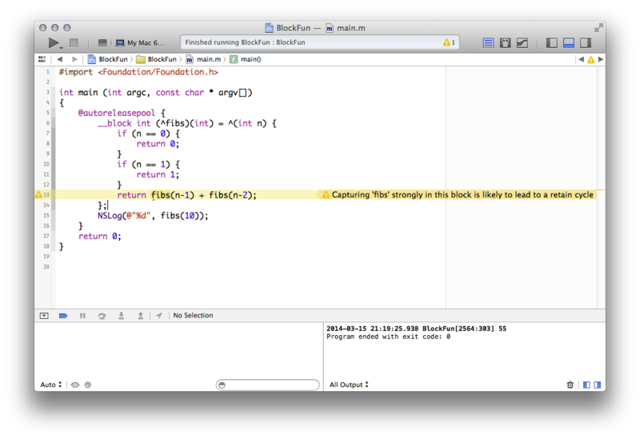

哪些事情不要拿 Block 來做
-------------------------

在很多狀況下，使用 block 相當方便，但由於因為 block 的記憶體管理問題，
有些事情使用 block 反而相當痛苦，就我個人而言，最痛苦的經驗應該就是拿
block 寫遞迴。舉個例子，假如要使用 block 來寫一個費式數列，可能會寫成
這樣（這邊是開啟 ARC 的環境）：

``` objc
 int (^fibs)(int) = ^(int n) {
	if (n == 0) {
		return 0;
	}
	if (n == 1) {
		return 1;
	}
	return fibs(n-1) + fibs(n-2);
};
```

看起來好像沒有問題，但是一執行就會馬上 crash。


原因是在 fibs 這個 Block 的 scope 裡頭，fibs 這個變數被指向 NULL。一般
來說，對 nil 物件做任何 Objective-C 呼叫都沒事，但是如果一個 Block 變
數指向 NULL，一呼叫就會因為 Bad Access 錯誤而 crash。而當你寫出這段一
定會 crash 的程式，compiler 也都不會發出警告…誰說用了 ARC 就不會有記憶
體管理問題呢？

那麼，我們在 `fibs` 前面加上個 __block 看看？

``` objc
__block int (^fibs)(int) = ^(int n) {
	if (n == 0) {
		return 0;
	}
	if (n == 1) {
		return 1;
	}
	return fibs(n-1) + fibs(n-2);
};
```

結果，這樣的程式會因為循環 retain 而造成記憶體漏水。



所以這段 code 要寫成這樣才不會有問題：

``` objc
__block int (^fibs)(int);
int (^fibs_)(int) = ^(int n) {
	if (n == 0) {
		return 0;
	}
	if (n == 1) {
		return 1;
	}
	return fibs(n-1) + fibs(n-2);
};
fibs = fibs_;
```


