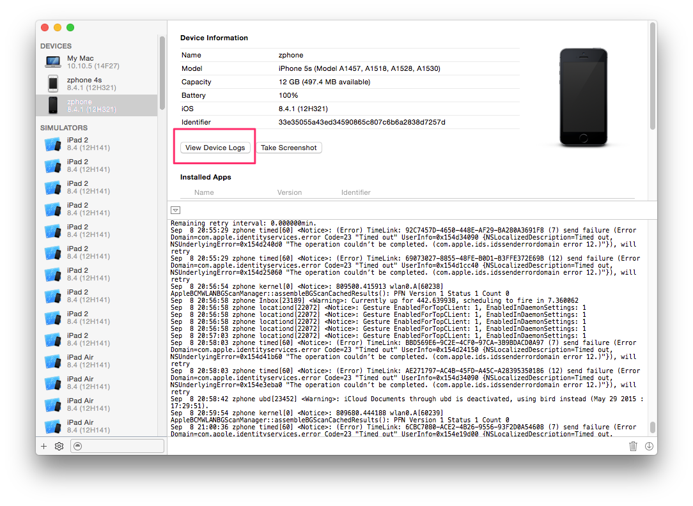
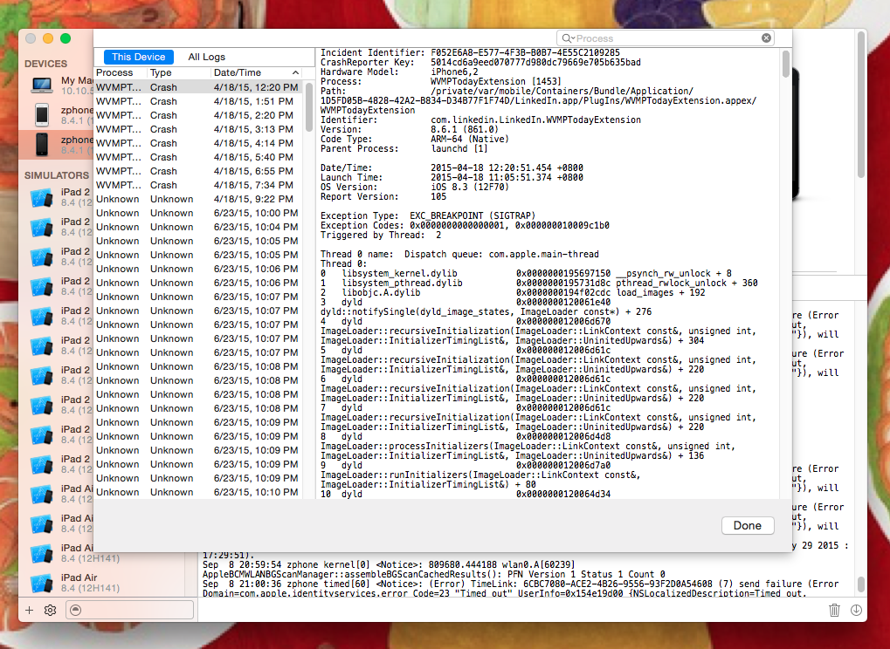
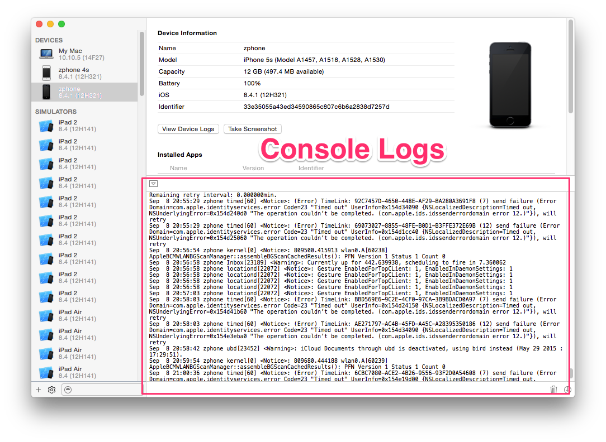
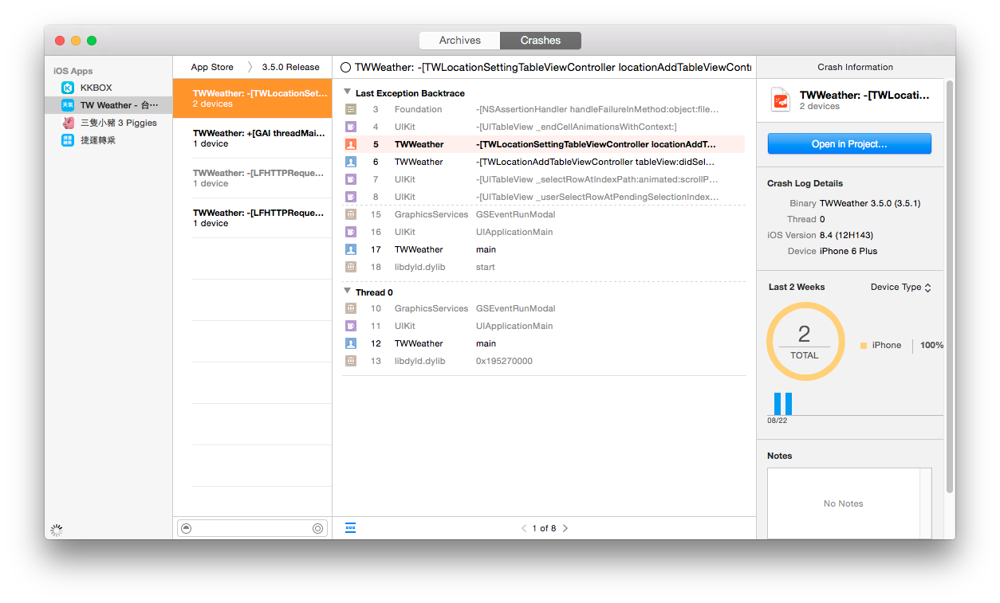
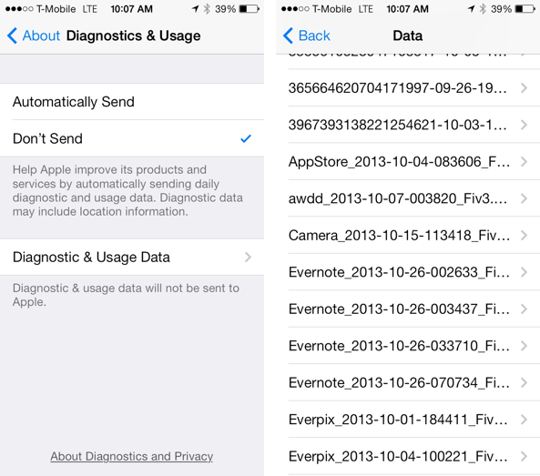

如何收集 Crash Reports
----------------------

在知道怎麼閱讀 crash report 之前，我們首先要收集到 crash report。

### 透過 Xcode 收集

如果是在我們自己的裝置上發生了 crash，要找到 crash report 最簡單的方法，
就是透過 Xcode。我們先將裝置連接到 Mac 上，從 Xcode 的選單中，選擇
Window -> Devices，就會出現一個 window。

在這個 window 的左方會列出所有目前可用的裝置，如果你是在開發 Apple
Watch App，Apple Watch 不會獨立顯示，而是會依附在與 Apple Watch 配對的
iPhone 上。除了連接的 iOS 設備外，由於 Xcode 也可以用來開發 Mac App，
所以你自己正在使用的這台 Mac 也會被當做是一台專屬裝置。

在左下方會列出目前所有 Xcode 可以使用的 iOS 模擬器，如果你覺得平常在
Xcode 選單中的 iOS 模擬器太多—iPhone 4、5、6 都列出來－實在顯得雜亂，
或有個需要用到的模擬器之前被關閉了，你也可以在這邊管理。

我們選擇了指定的 iOS 裝置後，從畫面右方，點選「View Device Logs」按鈕。

接下來會跳出另外一個 window。這個 window 的左方會列出目前所存放的
crash report，按照 App 名稱與時間排列。我們可以就我們所知道的 crash 發
生時間，找到我們的 App 的 crash report。

如果在你的團隊中有 QA 人員，我們建議在 QA 人員也使用 Mac 電腦，同時安
裝 Xcode，並且在 crash 發生的同時，除了 crash report 之外，也把
console logs 目前所有的內容也剪下來一份。因為在發生 crash 的時候，在
console 上面同時也會 print 出來一些重要資訊。

### 透過 iTunes Connect 收集

產品上線之後，蘋果其實也會幫我們收集 crash report。從 iTunes Connect
的 App 資訊頁面中，在最下方可以看到一個叫做「Crash Reports」的連結，接
下來就會導引到查看 crash reports 的頁面。

在 iTunes Connect 上，蘋果會幫我們列出每個主要作業系統版本上的十大
crash 原因，如果我們想在推出下一個版本之前，把前一個版本的所有 crash
都修一輪，這個功能還算有用。

不過，我們更常遇到的狀況是，用戶遇到 crash之後，直接透過電話等方式向我
們的客服反應，我們需要解決的往往不只是某個版本有哪些問題，更需要的是可
以在最短的時間內，解決單一用戶的問題。

蘋果在後來幾個版本的 Xcode 中，也增加了瀏覽線上 crash 的功能（可以用
Window -> Organizer 功能叫出來） ，讓瀏覽 crash 變得方便一些，但一樣沒
有找到特定用戶 crash 的辦法。

### 直接從 iOS 裝置上瀏覽 crash log

如果 crash 是發生在用戶的裝置上，我們不太有機會可以叫用戶安裝 Xcode—如
果不是因為工作的需求，誰會安裝這麼肥大的軟體呢？我們也不太可能直接拿到
用戶的裝置蒐集 log，畢竟我們在台灣，用戶可能會在世界的任何一個角落。很
多時候，我們會想辦法請用戶直接從裝置上協助我們取得 crash report。

我們可以從系統設定 App 找到 crash report，不過，不同版本的 iOS 中，
crash report 存放的位置不太一樣。

- iOS 8 之前，放在 Settings->General->About->Diagnostics & Usage
- iOS 8 開始，放在 Settings->Privacy->Diagnostics & Usage

在這個畫面中，點選了 Diagnostics & Usage Data 選項，就可以看到這台裝置
上的 crash report 列表。點下去之後，就可以看到 crash report 的內容。

在這個畫面中，用戶其實很難把 crash report 拿出來。因為這個畫面就只有一
個簡單的 text view 顯示 crash report，沒有任何方便匯出的功能，要不就是
請用戶想辦法全選後另外找一個文字編輯 App 貼上，要不就是要請用戶拍攝螢
幕截圖，而當我們收到螢幕截圖之後也很麻煩，因為接下來我們要解開 crash
的 call stack 中的記憶體位置，只有截圖，就只能對圖片中的文字做肉眼 OCR。

### 透過第三方服務收集

從 iTunes Connect 上很難掌握單一用戶發生的 crash，從用戶裝置上抓 log也
很麻煩，因此像 TestFlight[^1]、 Crashlytics 或 HockeyApp 等廠商就看準了這
種需求推出服務，安裝這些服務的 SDK 後，這些服務會幫我們盡可能的收集
crash report，在 SDK 中設定必要的資訊後，我們便可以透過特定的 user ID，
找到特定用戶發生的 crash。

像 Crashlytics SDK，就可以呼叫 `+setUserIdentifier:`、
`+setUserName:`與 `setUserEmail`[^2]，在 HockeyApp SDK 中，則是要在
App 中實作
[BITHockeyManagerDelegate](http://hockeyapp.net/help/sdk/ios/3.0.0RC1/Protocols/BITHockeyManagerDelegate.html)
protocol，告訴 HockeyApp 用戶 ID。

在使用這些服務的時候，他們會告訴我們要上傳每個版本的 debug symbol，原
因是，當我們發行 release build 的時候，compiler 會把程式中的 Debug 資
訊抽掉—不然所有人只要一拿到 crash report，就可以輕鬆知道我們 App 是怎
麼寫的，而形成安全性的風險。所以在發生 crash 時，crash log 中其實只有
發生錯誤的 function/method 的記憶體位置，必須要有 debug symbol 檔案才
能還原。而 Crashlytics 或 HockeyApp，可以幫我們在 server 上就還原記憶
體位置，讓我們不必手動做這件事。

我們在這邊不特別推薦使用哪一家的服務，建議你各自試試看，然後就功能與價
格自行比較。

如果我們在 App 中用了 Google 的 Google Analytics 服務，統計 App 中每個
功能的用量，可以注意到，其實 Google 也會幫我們蒐集 crash report，但由
於 Google Analytics 並不會還原記憶體，所以 Google Analytics 蒐集的資料，
對我們解決問題沒有太多幫助，但 Google 的報表拿來看長時間 crash 的趨勢
變化倒還頂不錯。

這些服務攔截 crash report 的原理是，當 exception 發生的時候，其實 App
會對自己發送一個 UNIX signal，原始的 signal handler 做的事情就是在
console 上 print 訊息、產生 crash report 並且停止應用程式。其實
Objective-C 裡頭的 try...catch 也是透過 UNIX signal 實作的，我們不妨想
像整個 App 其實都做了一個很大的 try...catch，只是這個 catch 做的事情就
只有讓 App crash。

這些服務要求你在 App 啟動的時候，也啟動他們的服務，目的就在於改變
signal handler，讓他們可以將 crash report 攔截下來，在下一次啟動的時候，
再找個恰當的時間回傳。

如此一來我們可以知道：如果我們的 crash 發生在這些服務啟動之前，那麼這
些服務也攔截不到 crash report，所以啟動這些服務的時機應該要盡可能早。
另外，由於這些 SDK 也改變了 signal handler 的行為，原本一些狀況下 App
應該要發生 crash，當我們加了某些服務的 SDK 之後，他們的 signal handler
的實作反而會是只收集 crash report，但是當 App 繼續執行；所以，當用戶回
報某個功能無法使用，其實很有可能是已經發生了 exception。

此外，如果是我們的 App 記憶體用量使用太多，導致被系統中斷，這種 crash
report 也沒辦法蒐集到，因為這種 crash 是由外部的 watch dog 造成的，而
不是內部的 UNIX signal 驅動的。

[^1]: 後來被蘋果併購
[^2]: 參考 http://support.crashlytics.com/knowledgebase/articles/92521-how-do-i-set-user-information-
