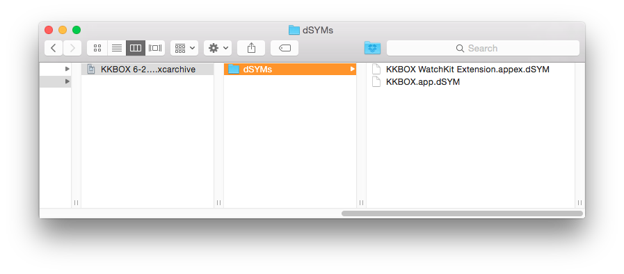
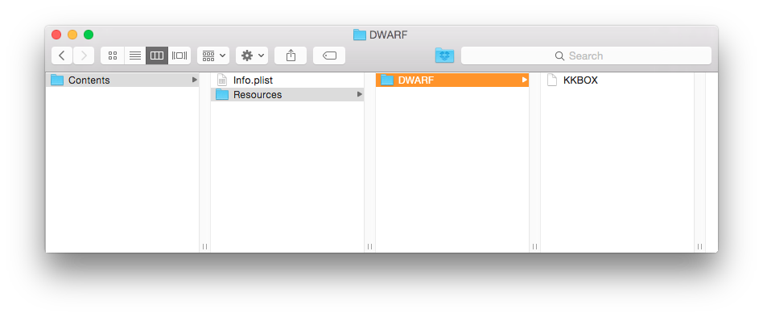
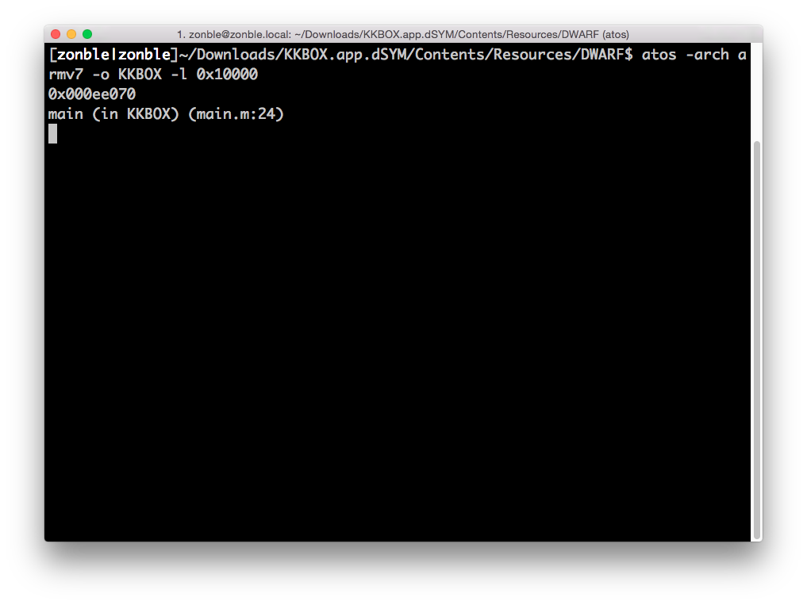
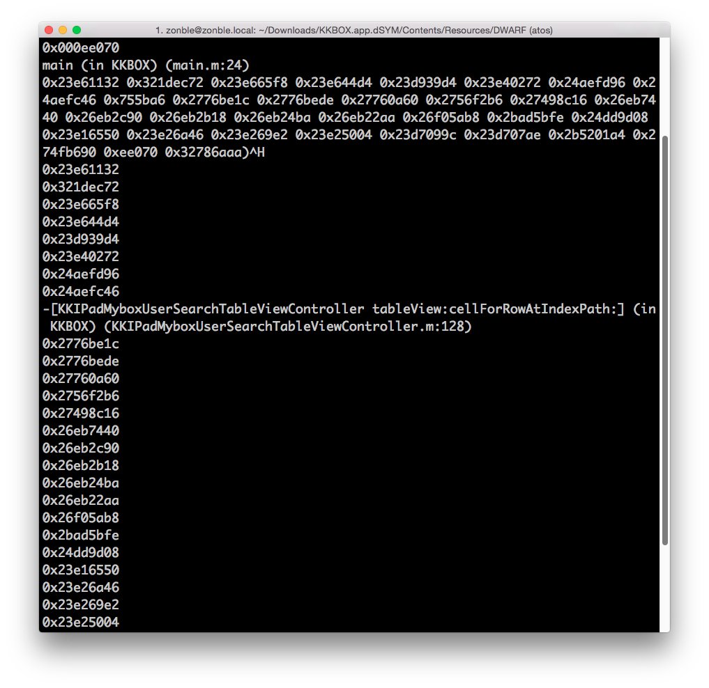

解開記憶體位置
--------------

### Debug Symbol

要解開 crash report 中的記憶體位置，必須要有 debug symbol。為了在閱讀
crash report 時可以找得到 debug symbol，我們建議盡可能保留所有的 build，
在提供 QA 或是公司內部其他成員測試的時候，應該要透過統一的入口。

如果有位同仁找了一位 iOS 工程師安裝版本，這位工程師直接用 Xcode 跑了
run 安裝一個版本，發生 crash 的時候，這位同仁可能會找另外一位 iOS 工程
師解決，這種狀況下，可能根本搞不清楚當時裝的是哪個版本，用的是哪個版本
的 SDK 以及 Xcode—不同版本 SDK 與 Xcode 也會編出不同的 binary。我們建
議在發行內部版本時，會透過同一台 build machine 編譯，像是架設內部的
Jenkins 等持續整合服務，或是透過 Crashlytics 或 HockeyApp 發佈內部版本。

當你在 Xcode 選擇 Product->Archive 之後，我們可以從 Organizer window
中找到剛剛建立好的 archive，debug symbol 就放在 archive 裡頭。我們對
archive 檔案按右鍵，從右鍵選單中選擇「Show Package Contents」，就會跳
出這個 archive 的內容，debug symbol 就放在 dSyms 目錄下。



一個 App 可能有不只一個 debug symbol，像 KKBOX 除了主程式之外，還做了
Apple Watch 的 extension，所以也會有屬於 Apple Watch 這一端的 debug
symbol。

而我們在這邊看到的兩個 .dSYM 其實也都是 bundle，我們又要用右鍵選單的
「Show Package Contents」查看裡頭的內容。



以 KKBOX 來說，在 KKBOX.app.dSYM 下的 Contents/Resources/DWARF/KKBOX，
才是我們最後想使用的 debug symbol 檔案。

### atos

找到 debug symbol 後，我們現在要用 atos（address to symbol）這個
command line 指令。重要參數包括：

- -arch，我們要使用哪個 architecture。在這邊我們輸入 armv7，如果是 64
  位元環境則輸入 arm64；如果是解決 Mac 的問題，則可能是 x86_64 或 i386。
- -o，debug symbol 檔案。我們傳入剛才找到的
  Contents/Resources/DWARF/KKBOX 的完整路徑。
- -l，KKBOX 被載入到哪段記憶體位置。在前一章當中，我們知道是在
  0x10000 - 0xc1bfff，所以輸入 0x10000。

我們首先會輸入 Thread 0 裡頭 call stack 中位在 14 的 0x000ee070 這個記
憶體位置。在 main thread 中，call stack 的底層一定是 `main`，如果不是
`main`，就代表我們找錯 debug symbol 了。



看起來沒錯。接著我們可以把整個 exception 的 call stack 貼進去。



由於我們的 debug symbol 只會包含 KKBOX，不包含 UIKit 等系統 library，
所以只會顯示屬於 KKBOX 的問題。總之，我們問題出在
KKIPadMyboxUserSearchTableViewController 這個 class 裡頭的
`tableView:cellForRowAtIndexPath:` 裡頭，位在
KKIPadMyboxUserSearchTableViewController.m 第 128 行。

### 修正問題

接著我們就可以去檢查 KKIPadMyboxUserSearchTableViewController.m 第 128
行做了什麼，我們發現，這是 KKBOX 的用戶搜尋功能中，用來顯示搜尋結果的
相關部分，我們預期用戶的名稱會是字串。搭配 QA 提供給我們的 console log

> Info: \*** Terminating app due to uncaught exception
> 'NSInvalidArgumentException', reason: '-[NSNull length]:
> unrecognized selector sent to instance 0x3a866830'

看起來我們預期的是字串，但是 server 的 API 提供的 JSON 回應中，用戶名
稱卻是 null。我們在 Objective-C 語言中，會把 JSON 的 null 轉成 NSNull
型別，所以呼叫屬於字串的 `length` 這個 method 時，就會出現找不到
selector 的錯誤。所以，我們在這邊要做一些型別判斷，當用戶名稱是 null
的時候，要用別的方式顯示。

說起來 NSNull 還頂討厭的，有時候我們會希望就算程式中任何地方出現
NSNull，都不會 crash。由於跟 NSNull 有關的 crash 往往是找不到 selector，
如果想要一勞永逸：讓 NSNull 可以回應所有的 selector，如何？

我們從第一章中了解 Objective-C 的動態特性，知道可以對任何 class 添加
method，最簡單的方法就是使用 category；Objective-C 物件還有另外一個特
性：如果一個 class 並沒有某個 selector，在找不到 selector 的時候，會先
透過 `forwardInvocation:`，詢問這個 class 要不要把這次的呼叫交給別的物
件處理。

透過這兩個特性，就可以來施點動態魔法：透過 category 實作 NSNull 的
`forwardInvocation:`。


``` objc
@interface NSNull (SafeNull)

@end

@implementation NSNull (SafeNull)

- (NSMethodSignature *)methodSignatureForSelector:(SEL)aSelector
{
	NSMethodSignature *signature = [super methodSignatureForSelector:aSelector];
	if (!signature) {
		NSMethodSignature *sig = [NSMethodSignature signatureWithObjCTypes:@encode(void)];
		return sig;
	}
	return signature;
}

- (void)forwardInvocation:(NSInvocation *)anInvocation
{
}

@end
```
