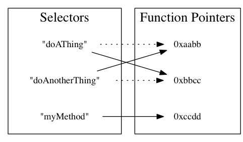

Selector 是 Objective-C 中所有魔法的開始
----------------------------------------

Objective-C 物件有哪些 method，就是這個物件的 Class 的 virtual table中，
有多少 selection/C function pointer 的 pair，這個特性造就了在
Objective-C 中可以做很多神奇的事情，同時也造成了 Objective-C 這門語言
的限制。

Objective-C 的神奇之處，就在於，既然物件有哪些 method 可以在 run time
決定，因此每個物件也都可以在 run time 的時候改變。我們可以在不用繼承物
件的情況下，就增加新的 method，通常最常見作法的就是我們接下來要討論的
category，我們也可以隨時把既有的 selector 指到不同的 C function
pointer 上，像是把兩個 selector 所指向的 function pointer 交換，這種交
換 selector 實作的作法叫做 method swizzling—我們暫時還不會討論到這邊。

由於一個 selector 只會指向一個實作，因此， Objective-C 不會有 C++、
Java、C\#等語言當中的
[overloading](http://www.wikiwand.com/en/Function_overloading)。所謂
overloading，就是可以容許有多個名稱相同，但是參數型別不同的 function或
method 存在，在呼叫的時候，如果傳入了指定型別的參數，就會呼叫到屬於該
參數型別的那一組 function 或 method。在 Objective-C 當中，同一個名稱的
method，就只會只有一套實作，如果有多個名稱相同的 method，就會以最後在
runtime 載入的那一組，代替之前的實作。

Objective-C 的 virtual table 像是一個 dictionary，而 C++、Java 等語言
的 virtual table 則是一個 array。在 Objective-C 中，我們呼叫
`[someObject doSomthing]` 時，我們是在表格中尋找符合 "doSomething" 這
個字串的 method，在 C++ 或 Java 中，我們呼叫
`someObject.doSomething()`時，在做的事情大概是要求「執行 virtual table
中的第八個 method」這樣的事情。

由於每做一次 method 的呼叫，都是在做一次 selector/function pointer 的
查表，與其他較靜態的語言相較，這個查表的動作相當耗時，因此執行效能也比
不上C++ 等程式語言。Objective-C 其實是一門相當古老的語言，在 1984 年時
便問世，但就因為效能問題，在整個 80 到 90 年代根本乏人問津，直到 2008
年iPhone SDK 推出之後才逐漸成為主流語言。

但 Objective-C 這樣做又有另外一項優點：我們的 App 不需要連結特定版本的
runtime 與 libraries，就算 libraries 中 export 出來的 function 換了位
置，只要 selector 不變，還是可以找到應該要執行的 C function，所以舊的
App 在新版本的作業系統上執行時，新版本作業系統並不需要保留舊版的
Libraries，而避免了 C++ 等語言中所謂
[DLL Hell](https://en.wikipedia.org/wiki/DLL_Hell) 問題。

到了 2014 年，蘋果在 iOS 與 Mac OS X 平台上又推出了新的程式語言 Swift，
標榜 Swift 是比 Objective-C 更新、執行效能更好的程式語言，Swift 之所以
效能會比 Objective-C 好，其中一點，就是因為 Swift 又改變了 virtual
table 的實作，走回像是 C++、Java 等語言的 virtual table 設計。因為
Swift 也有必須連結指定版本 runtime 的問題，所以在每個 Swift App 的 App
bundle 中，其實都包了一份 Swift runtime。
