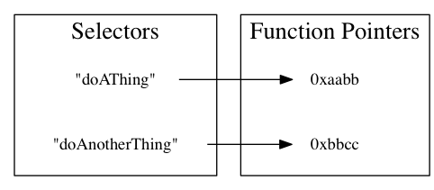
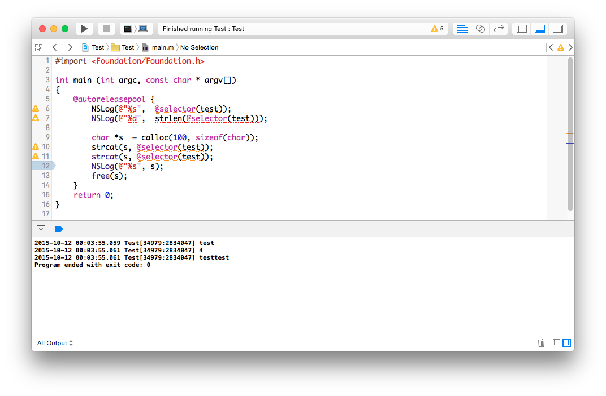
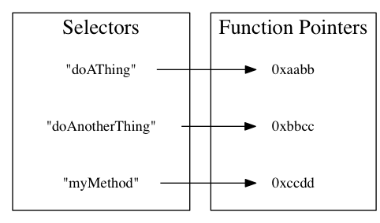

Objective-C Class/Object 到底是什麼？
-------------------------------------

你應該在其他的文件裡頭聽說過，Objective-C 是 C 語言的 Superset，在 C語
言的基礎上，加上了一層稀薄的物件導向，而 Cocoa Framework 的 Cocoa這個
名字就是這麼來的—Cocoa 就是 C 加上 OO。也因此，在 Objective-C程式中，
可以直接呼叫 C 的 API，而如果你將 .m 改名叫做.mm，程式裡頭還可以混和
C++ 語法，變成 Objective-C++。

Objective-C 的程式在 compile time 時，Compiler 其實會編譯成 C然後繼續
編譯。所有的Objective-C Class 會變成 C 的 Structure，所有的method （以
及 block）會被編譯成 C function，接下來，在執行的時候，Objective-C
runtime 才會建立某個 C Structure 與 C function 的關聯，也就是說，一個
物件到底有哪些 method可以呼叫，是在 runtime 才決定的。

### Objective-C 物件會被編譯成 Structure

比方說，我們現在寫了一個簡單的 Class，裡頭只有 int a 這個成員變數：

``` objc
@interface MyClass : NSObject {
    int a;
}
@end
```

會被編譯成

``` c
typedef struct {
    int a;
} MyClass;
```

因為 Objective-C 的物件其實就是 C 的 structure，所以當我們建立了一個
Objective-C 物件之後，我們也可以把這個物件當做呼叫 C structure 呼叫
[^1]：

``` objc
MyClass *obj = [[MyClass alloc] init];
obj->a = 10;
```

### 對 Class 加入 method

在執行的時候，runtime 會為每個 class 準備好一張表格（專用術語叫做
virtual table），表格裡頭會以一個字串當 key，每個 key 會對應到 C
function 的指標位置。Run time 裡頭，把實作的 C function 定義成 `IMP`
這個type；至於拿來當作 key 的字串，就叫做 selector，type 定義成 `SEL`，
然後我們可以使用 @selector 關鍵字建立 selector。



而其實 `SEL` 就是 C 字串，我們可以來寫點程式檢查一下：

``` objc
NSLog(@"%s", (char *)(@selector(doSomething)));
```

我們會順利印出「doSomething」這個 C 字串。



每次我們對一個物件呼叫某個 method，runtime 在做的事情，就是把 method的
名稱當做字串，尋找與字串符合的 C function實作，然後執行。也就是說，下
面這三件事情是一樣的：

我們可以直接要求某個物件執行某個 method：

``` objc
[myObject doSomthing];
```

或是透過 `performSelector:` 呼叫。 `performSelector:` 是 `NSObject` 的
method，而在 Cocoa Framework 中所有的物件都繼承自 `NSObject`，所以每個
物件都可以呼叫這個 method。

``` objc
[myObject performSelector:@selector(doSomething)];
```

我們可以把 `performSelector:`想成台灣的電視新聞用語：如果原本的句子是
「我正在吃飯」，使用`performSelector:`就很像是「我正在進行一個吃飯的動
作」。而其實，最後底層執行的是`objc_msgSend` 。

``` objc
objc_msgSend(myObject, @selector(doSomething), NULL);
```

我們常常會說「要求某個 object 執行某個 methood」、「要求某個 object執
行某個 selector」，其實是一樣的事情，我們另外也常聽到一種說法，叫做
「對 receiver 傳遞message」，這則是沿用來自 Small Talk 的術
語—Objective-C 受到了 Small Talk 語言的深刻影響—但其實也是同一件事。

因為一個 Class 有哪些 method，是在 run time 一個一個加入的；所以我們就
有機會在程式已經在執行的時候，繼續對某個 Class 加入新 method，一個
Class已經存在了某個 method，也可以在 run time 用別的實作換掉，一般來說，
我們會用 Category 做這件事情，不過 Category會是下一章的主題，會在下一
章繼續討論。

我們在這裡首先要記住一件非常重要的事：在 Objective-C 中，一個 class 會
有哪些 method，並不是固定的，如果我們在程式中對某個物件呼叫了目前還不
存在的 method，編譯的時候，compiler 並不會當做編譯錯誤，只會發出警告而
已，而跳出警告的條件，也就只有是否有引入的 header 中到底有沒有這個
method而已，所以我們一不小心，就很有可能呼叫到了沒有實作的method（或這
麼說，我們要求執行的 selector並沒有對應的實作）。如果我們是使用
`performSelector:`呼叫，更是完全不會有警告。直到實際執行的時候，才發生
unrecognized selector sent to instance 錯誤而導致應用程式 crash。

之所以只有警告，而不當做編譯錯誤，就是因為某些 method有可能之後才會被
加入。蘋果認為你會寫出呼叫到沒有實作的selector，必定是因為你接下來在某
個時候、某個地方，就會加入這個 method的實作。

由於 Objective-C 語言中，物件有哪些 method 可以在 run time 改變，所以
我們也會將 Objective-C 列入像是 Perl、Python、Ruby等所謂的動態語言
（Dynamic Language）之林。而在寫這樣的動態物件導向語言時，一個物件到底
有哪些method 可以呼叫，往往會比這個物件到底是屬於哪個 class 更為重要。
[^2]

如果我們不想要用 category，而想要自己動手寫點程式，手動將某些 method
加入到某個 class 中，我們可以這麼寫。首先宣告一個 C function，至少要有
兩個參數，第一個參數是執行 method 的物件，第二個參數是 selector，像這
樣：

``` objc
void myMethodIMP(id self, SEL _cmd) {
    doSomething();
}
```

接下來可以呼叫 `class_addMethod` 加入 selector 與實作的對應。

``` objc
#import <objc/runtime.h>
// 中間省略
class_addMethod([MyClass class], @selector(myMethod), (IMP)myMethodIMP, "v@:");
```

接下來就可以這麼呼叫了：

``` objc
MyClass *myObject = [[MyClass alloc] init];
[myObject myMethod];
```



[^1]: 不過，如果你直接在程式裡頭這麼呼叫，Xcode 會在編譯的時候發出警告，告訴你在不久的將來會禁止這樣直接呼叫物件的成員變數，如果想要取用成員變數，必須另外寫 getter/setter。而如果這個成員變數被宣告成是 private 的，Xcode 會直接出現編譯錯誤，禁止你這樣呼叫。

[^2]: 這種強調物件有哪些 method，會比物件繼承自哪個 Class 來得重要的觀念，有一個專有名詞，叫做 Duck Typing，中文翻譯做「鴨子型別」。觀念是：我眼前這個東西到底是不是鴨子？它是不是鳥類或是哪個種類根本就不重要，反正它走路游泳像鴨子，叫起來像鴨子，那我就當它是鴨子。可以參見Wikipedia 上的說明： <http://en.wikipedia.org/wiki/Duck_typing> 。
