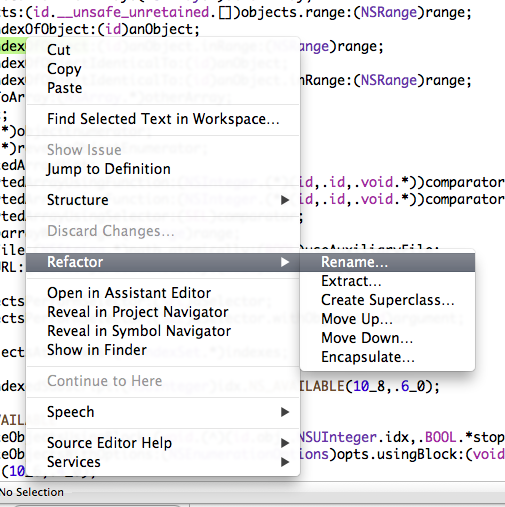

呼叫 performSelector: 需要注意的地方
-----------------------------------

我們在呼叫 `performSelector:` 的時候要注意幾點：

### 對 super 呼叫 performSelector:

前面雖然提到，對一個物件直接呼叫某個 method，或是透過
`performSelector:`呼叫，意義是一樣的，但如果是對 super 呼叫，卻有不一
樣的結果。如果是：

``` objc
[super doSomthing];
```

代表的是呼叫 super 的 doSomthing 實作。但如果是：

``` objc
[super performSelector:@selector(doSomething)];
```

呼叫的是 super 的 `performSelector:` ，最後結果仍然等同於
`[self doSomething]` 。

### Refactor 工具

隨著專案的發展，我們可能後來覺得當初某個 method的命名並不恰當，所以想
要換個名字，這時候與其使用搜尋/替代功能，不如直接使用Xcode 提供的
Refactoring 工具：在想要改名字的 method上面點選滑鼠右鍵，就會出現選單，
然後從「Refactor」中選擇「Rename」。



執行之後，Xcode 除了把這個 method
的名字換掉，也會同時更新所有專案中呼叫這個 method
的程式，但，如果我們當初是用 `performSelector:` 呼叫要執行的
method，Xcode 並不會把裡頭的 selector
也換掉，只會出現簡短的警告訊息而已，如果我們忽略了這些警告，之後執行的時候，就會出現找不到
selector 的錯誤。我們需要格外小心。
